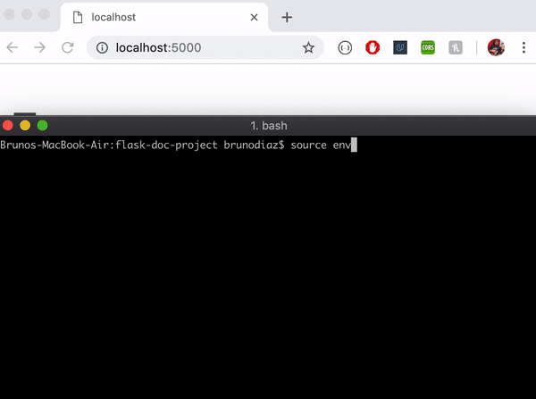

# Flaskr

Flaskr is a web app in where users can register, log in, and create posts other users can see.
Users can edit/delete any post they create.

# How to Run Flask App

```bash
source env_setup  # Sets up Flask Environments
flask init-db     # Creates/Sets up Database
flask run         # Runs Flask App (Defaulted in Dev mode based on env)
```




## flask-doc-project
http://flask.pocoo.org/docs/1.0/tutorial
